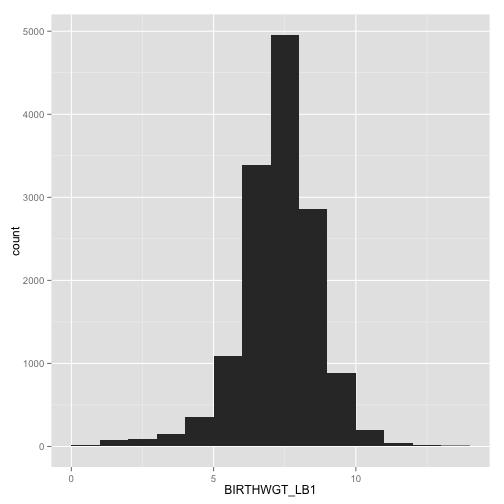
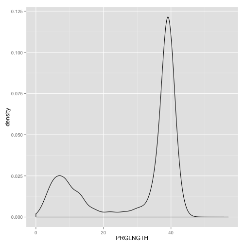
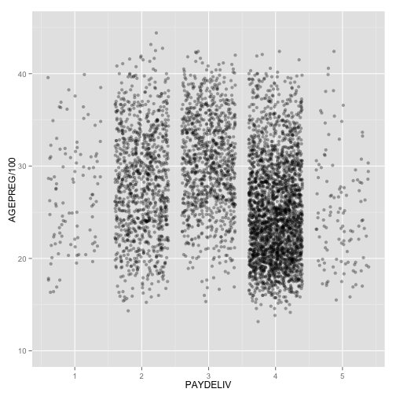
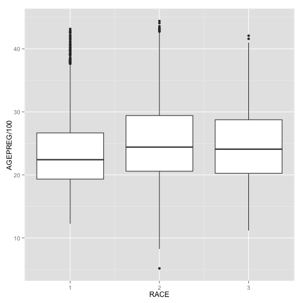
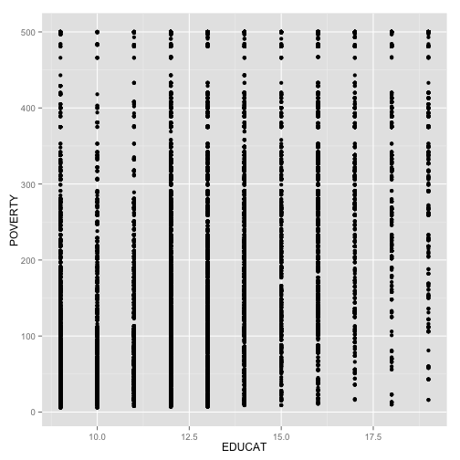
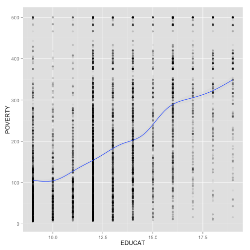
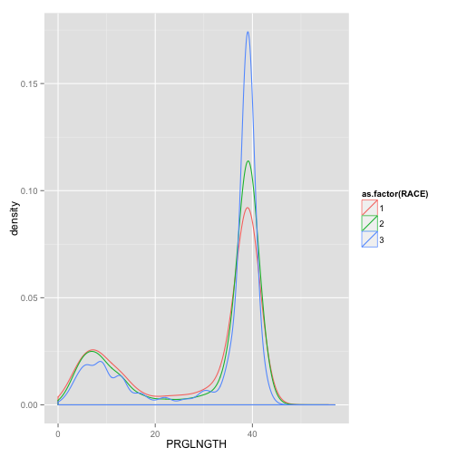
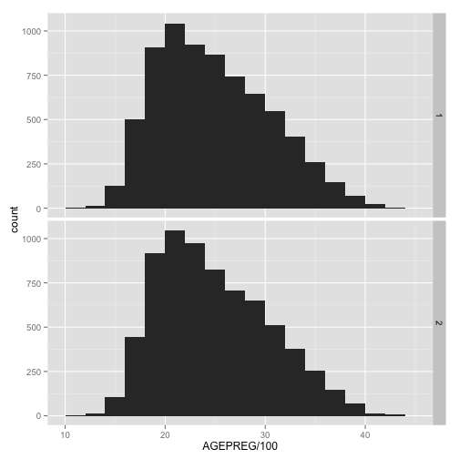

ggplot
========================================================
author: Shi Tang
date: 2015.1

Outline
========================================================
incremental: true
- Simple Graphs
 - <small>Histogram</small>
 - <small>Density plots</small>
 - <small>Jittered points</small>
 - <small>Boxplot</small>
 - <small>Scatter plots</small> 
 - <small>Add a soomther</small>
  
- complex Graphs
 - <small>Add an aesthetic attribute</small>
 - <small>Faceting</small>
  
Datasets
========================================================


```r
FemPreg <- read.fwf("data/2006_2010_FemPreg.dat", 
             widths = pregcolwidths, 
             col.names = pregcolnames)
library(ggplot2)
library(plyr)
library(dplyr)
library(mgcv)
```

Simple graphs --- Histogram
========================================================
- geom = "histogram"
- set *binwidth*: You may find that gross features of the data show up well at a large bin width, while finer features require a very narrow width
- Break points can also be specified explicitly, using the breaks argument
- xlim = c(x1,x2) 

Simple graphs --- Histogram
========================================================
left:60%
 
***
We can conclude that most babyweights are between 5 to 10 pounds. 

Simple graphs --- Density plots
========================================================
- geom = "density"
- the *adjust* argument controls the degree of smooth- ness (high values of adjust produce smoother plots


Simple graphs --- Density plots
========================================================
left:60%
 
***
We can conclude that pregnant woman often need around 40 weeks(10 month) to give birth to child. And at around 8th weeks, there is the highest risk to lose a child.

Simple graphs --- Jittered points
========================================================
 - geom = "jitter"
 - show every point
 - use alpha = I(1 / n) to solve overplotting problem (n means levels of transparency)

Simple graphs --- Jittered points
========================================================
left:60%
 
***        
We can conclude that people like to choose the 4th payment most. And the 2nd and 3rd payment is also popular.Few people will choose the extremly low or high payment.  In additional, 

Simple graphs --- Boxplot
========================================================
- geom = "boxplot"
- group = round_any(xxx, n)
- box-and-whisker plots

Simple graphs --- Boxplot
========================================================
left:60%
 
***                            
We can conclude that 1st race women prefer giving birth to child in their young age. No matter race a woman is, there are more chances that she will give birth to child before 30. 

Simple graphs  ---  Scatter plots(need change)
========================================================
- geom = "point" 
- This is the default when you supply both x and y arguments to qplot().

Simple graphs  ---  Scatter plots(need change)
========================================================
left:60%
 
***
In this case,it can be hard to see exactly what trend is shown by the data. So we add a smoothed line to the plot. This is easily done using the smooth geom.

Simple graphs --- Add a soomther
========================================================
left:60%
 
***
We can conclude that with higher education, people will earn more when graduate. 

Complex graphs --- Add a soomther
========================================================
 - method = "loess" : the defalt for small n    
  - Use span = 0(exceedingly wiggly) to 1(not so wiggly) 
 - method = "gam" : the defalt method for more than 1000 points
  - Use formula y ~ s(x, bs = "cs")
 - method = "lm" : fits a linear model
  - Use formula = y ~ ns(x,k) *k is the degree of freedom*
 - method = "rlm" : outliers don't effect the fit as "lm"
*<small>turn off the confidence interval: se=FALSE</small>*


complex graphs --- Add an attribute
========================================================
- use aesthetics(*colour*, *fill*, *size*, *shape*) to compare subgroups
 - as.factor() 
- use *facets* 
 - It creates tables of graphics by splitting the data into subsets and displaying the same graph for each subset in an arrangement that facilitates comparison.
 
complex graphs --- Add an aesthetic attribute
========================================================
left:60%
 
***
We can conclude that pregnant woman, no matter race she is, often needs around 40 weeks(10 month) to give birth to child. 

complex graphs --- Faceting
========================================================
left:60%
 
***
We can conclude that the number of girl babies is almost equal to the number of boy babies. 
