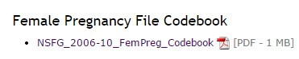
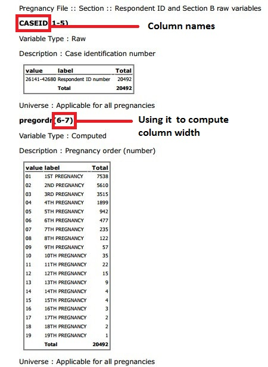

Reading data into R
========================================================
author: Ziyi Kang
date: 2014/11/18  

Reading data into R
========================================================


- Reading data in
  Various information that you would need.
  
-  Reading data files
  -  read.table()
  -  read.csv()
  -  read.delim()
  -  read.fwf()

Structure of Data
========================================================


-  Data files
-  Metadata/codebook
-  Demonstrate how to use a codebook

Using a codebooks 
========================================================


In order to identify the names of columns in the data file,we need to use a codebook
http://www.cdc.gov/nchs/nsfg/nsfg_2006_2010_puf.htm

 


Using a codebooks 
========================================================


Reading .dat file into R 
========================================================


1.Identify column names
```{r}
pregcolnames <- c("CASEID", "pregordr", "HOWPREG_N", "HOWPREG_P", 
"moscurrp", "NOWPRGDK", "PREGEND1", "PREGEND2", 
"PREGEND3", "HOWENDDK", "NBRNALIV", "MULTBRTH", 
"bornaliv", "DATPRGEN_M", "DATPRGEN_Y", "cmotpreg", 
"AGEATEND", "GESTASUN_M", "GESTASUN_W", "wksgest", 
"mosgest", "DK1GEST", "DK2GEST", "DK3GEST", 
"bpa_bdscheck1", "bpa_bdscheck2", "bpa_bdscheck3", "BABYSEX1", 
"BIRTHWGT_LB1", "BIRTHWGT_OZ1", "LOBTHWGT1", "BABYSEX2", 
"BIRTHWGT_LB2", "BIRTHWGT_OZ2", "LOBTHWGT2", "BABYSEX3", 
"BIRTHWGT_LB3", "BIRTHWGT_OZ3", "LOBTHWGT3", "BABYDOB_M", 
"BABYDOB_Y", "cmbabdob", "kidage", "HPAGELB", 
"BIRTHPLC", "PAYBIRTH1", "PAYBIRTH2", "PAYBIRTH3", 
"PAYBIRTH4", "CSECPRIM", "CSECMED1", "CSECMED2", 
"CSECMED3", "CSECMED4", "CSECMED5", "CSECPLAN", 
"KNEWPREG", "TRIMESTR", "LTRIMEST", "PRIORSMK", 
"POSTSMKS", "NPOSTSMK", "GETPRENA", "BGNPRENA", 
"PNCTRIM", "LPNCTRI", "WORKPREG", "WORKBORN", 
"DIDWORK", "MATWEEKS", "WEEKSDK", "MATLEAVE", 
"LIVEHERE1", "ALIVENOW1", "WHENDIED_M1", "WHENDIED_Y1", 
"cmkidied1", "WHENLEFT_M1", "WHENLEFT_Y1", "cmkidlft1", 
"lastage1", "WHERENOW1", "LEGAGREE1", "PARENEND1", 
"ANYNURSE1", "FEDSOLID1", "FRSTEATD_N1", "FRSTEATD_P1", 
"FRSTEATD1", "QUITNURS1", "AGEQTNUR_N1", "AGEQTNUR_P1", 
"AGEQTNUR1", "LIVEHERE2", "ALIVENOW2", "WHENDIED_M2", 
"WHENDIED_Y2", "cmkidied2", "WHENLEFT_M2", "WHENLEFT_Y2", 
"cmkidlft2", "lastage2", "WHERENOW2", "LEGAGREE2", 
"PARENEND2", "ANYNURSE2", "FEDSOLID2", "FRSTEATD_N2", 
"FRSTEATD_P2", "FRSTEATD2", "QUITNURS2", "AGEQTNUR_N2", 
"AGEQTNUR_P2", "AGEQTNUR2", "LIVEHERE3", "ALIVENOW3", 
"WHENDIED_M3", "WHENDIED_Y3", "cmkidied3", "WHENLEFT_M3", 
"WHENLEFT_Y3", "cmkidlft3", "lastage3", "WHERENOW3", 
"LEGAGREE3", "PARENEND3", "ANYNURSE3", "FEDSOLID3", 
"FRSTEATD_N3", "FRSTEATD_P3", "FRSTEATD3", "QUITNURS3", 
"AGEQTNUR_N3", "AGEQTNUR_P3", "AGEQTNUR3", "prgoutcome", 
"outcom_s", "nbrnlv_s", "cmprgend", "cmendp_s", 
"cmprgbeg", "cmpbeg_s", "cmlastlb", "cmlstprg", 
"cmfstprg", "cmpg1beg", " cmintstr", 
"cmintfin", "cmintstrop", "cmintfinop", "cmintstrcr", 
"cmintfincr", "anyusint", "EVUSEINT", "STOPDUSE", 
"WHYSTOPD", "WHATMETH01", "WHATMETH02", "WHATMETH03", 
"WHATMETH04", "RESNOUSE", "WANTBOLD", "PROBBABE", 
"CNFRMNO", "WANTBLD2", "TIMINGOK", "TOOSOON_N", 
"TOOSOON_P", "WTHPART1", "WTHPART2", "FEELINPG", 
"HPWNOLD", "TIMOKHP", "COHPBEG", "COHPEND", 
"TELLFATH", "WHENTELL", "TRYSCALE", "WANTSCAL", 
"WHYPRG1", "WHYPRG2", "WHYNOUSE1", "WHYNOUSE2", 
"WHYNOUSE3", "WHYNOUSE4", "WHYNOUSE5", "MAINOUSE", 
"PRGLNGTH", "OUTCOME", "BIRTHORD", "DATEND", 
"AGEPREG", "DATECON", "AGECON", "FMAROUT5", 
"PMARPREG", "RMAROUT6", "FMARCON5", "RMARCON6", 
"LEARNPRG", "PNCAREWK", "PAYDELIV", "LBW1", 
"LIVCHILD", "BFEEDWKS", "MATERNLV", "OLDWANTR", 
"OLDWANTP", "WANTRESP", "WANTPART",
"cmbirth", "AGER", "agescrn", "FMARITAL", 
"RMARITAL", "EDUCAT", "HIEDUC", "RACE", 
"HISPANIC", "HISPRACE", "HISPRACE2", "RCURPREG", 
"PREGNUM", "PARITY", "CURR_INS", "PUBASSIS", 
"POVERTY", "LABORFOR", "RELIGION", "METRO", 
"BRNOUT", "yrstrus", "PRGLNGTH_I", "OUTCOME_I", 
"BIRTHORD_I", "DATEND_I", "AGEPREG_I", "DATECON_I", 
"AGECON_I", "FMAROUT5_I", "PMARPREG_I", "RMAROUT6_I", 
"FMARCON5_I", "RMARCON6_I", "LEARNPRG_I", "PNCAREWK_I", 
"PAYDELIV_I", "LBW1_I", "LIVCHILD_I", "BFEEDWKS_I", 
"MATERNLV_I", "OLDWANTR_I", "OLDWANTP_I", "WANTRESP_I", 
"WANTPART_I", "AGER_I", "FMARITAL_I", "RMARITAL_I", 
"EDUCAT_I", "HIEDUC_I", "RACE_I", "HISPANIC_I", 
"HISPRACE_I", "HISPRACE2_I", "RCURPREG_I", "PREGNUM_I", 
"PARITY_I", "CURR_INS_I", "PUBASSIS_I", "POVERTY_I", 
"LABORFOR_I", "RELIGION_I", "METRO_I", "FINALWGT30", 
"WGTQ1Q16", "WGTQ9Q16", "WGTQ5Q16", "WGTQ1Q8", 
"SECU", "SEST", "cmintvw", "cmlstyr", 
"cmjan3yr", "cmjan5yr", "questyear", "Quarter", "Phase" ) 
```

Reading .dat file into R 
========================================================


2.Identify column width
```{r,width=13}
pregcolwidths = 
  c(5, 2, 2, 1, 6, 1, 1, 1, 1, 1, 
    1, 1, 1, 2, 4, 4, 2, 2, 2, 2, 
    2, 1, 1, 1, 1, 1, 1, 1, 2, 2, #55
    1, 1, 2, 2, 1, 1, 1, 2, 1, 2, 
    4, 4, 3, 2, 1, 1, 1, 1, 1, 1, 
    1, 1, 1, 1, 1, 1, 2, 1, 1, 1, #99
    1, 1, 1, 2, 1, 1, 1, 1, 1, 2, #111
    1, 2, 1, 1, 2, 4, 4, 2, 4, #132
    4, 3, 1, 1, 1, 1, 1, 3, 1, 2, #150
    1, 3, 1, 2, 1, 1, 2, 4, 4, 2, 
    4, 4, 3, 1, 1, 1, 1, 1, 1, 1, 
    1, 1, 2, 1, 2, 1, 1, 1, 4, 4, 1, #208
    1, 1, 1, 1, 1, 1, 1, 1, 1, 1, 
    1, 1, 2, 1, 2, 1, 1, 1, 4, 4, #236
    4, 4, 4, 4, 4, 4, 4, 4, 4, 4, 4, 4, #284
    1, 1, 1, 1, 2, 2, 2, 2, 
    1, 1, 1, 1, 1, 1, 3, #305
    1, 1, 1, 2, 1, 1, 1, 1, 1, 1, 
    2, 2, 1, 1, 2, 1, 1, 1, 1, 2, 2,  #332
    1, 2, 4, 4, 4, 4, 1, 1, 1, 1, 1, #356
    2, 2, 1, 1, 1, 3, 1, 1, 1, 1, #370
    1, 4, 2, 2, 1, 1, 2, 2, #385
    1, 1, 1, 1, 1, 2, 2, 1, 1, 3, #399
    1, 1, 1, 1, 4, 
    1, 1, 1, 1, 1, 1, 1, 1, 1, 1, 
    1, 1, 1, 1, 1, 1, 1, 1, 1, 1, 
    1, 1, 1, 1, 1, 1, 1, 1, 1, 1, 
    1, 1, 1, 1, 1, 1, 1, 1, 1, 1, 1, #448
    18, 18, 18, 18, 18, 
    1, 3, 4, 4, 4, 4, 1, 2, 1 ) #562
```

Reading .dat file into R 
========================================================

-read.fwf():
Read Fixed Width Format Files
```{r,eval=FALSE}
read.fwf(file, widths, header = FALSE, 
         sep = "\t",skip = 0, 
         row.names,col.names, 
         n = -1,buffersize = 2000, ...)
help(read.fwf)
```

Reading .dat file into R 
========================================================
```{r,eval=FALSE}
FemPreg<-read.fwf("../data/2006_2010_FemPreg.dat", 
             widths = pregcolwidths, 
             col.names=pregcolnames)
```

Reading .txt file into R 
======================================================================================

-read.table():

Reads a file in table format and creates a data frame 
from it, with cases corresponding to lines and variables 
to fields in the file.
```{r,eval=FALSE}
read.table(file, header = FALSE, sep = "", 
           quote = "\"'",
           dec = ".", 
numerals = c("allow.loss", "warn.loss", "no.loss"),
           row.names, col.names, 
           as.is = !stringsAsFactors,
           na.strings = "NA", ...)
```

Reading .txt file into R 
======================================================================================
```{r}
FemPregTXT<-read.table("../data/FemPregTXT.txt",
            sep="\t",col.names=pregcolnames)

FemPregTXT[,c(1:4)]
```


Reading .csv file into R 
======================================================================================
-read.csv()
```{r,eval=FALSE}
read.csv(file, header = TRUE, sep = ",", 
         quote = "\"",dec = ".", 
         fill = TRUE, comment.char = "", ...)
```

Reading .csv file into R 
======================================================================================
```{r}
FemPregCSV<-read.csv("../data/FemPregCSV.csv",
                     header=TRUE,sep=",")

FemPregCSV[,c(1:4)]
```

Reading spreadsheet into R 
======================================================================================
-XLConnect package:
```{r}
library(XLConnect)
```
-readWorksheetFromFile()
```{r,eval=FALSE}
readWorksheetFromFile(file, sheet, header=FALSE, startCol, startRow, endCol, endRow, ...)
```

Reading spreadsheet into R 
======================================================================================
```{r}
FemPregSheet<-readWorksheetFromFile(
  "../data/FemPregSheet.xlsx",sheet="FemPreg")
FemPregSheet[,c(1:4)]
```
