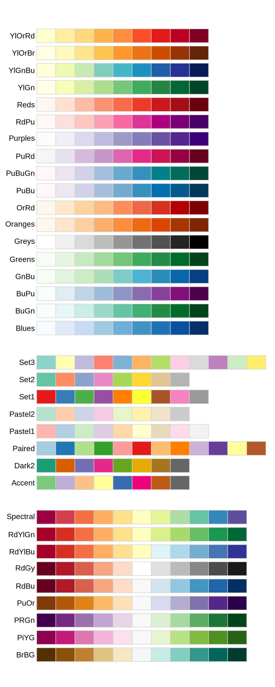

```{r setup, include=FALSE}
knitr::opts_chunk$set(echo = FALSE)
library(ggplot2)
library(dplyr)
library(magrittr)
library(RColorBrewer)
```

Overview
======

-  Statistical summaries and comparisons
-  Time series
-  Colors
-  Themes

Statistical summaries and comparisons
=============

-  You can use visualizations to take complex look at a data set.
-  Start from a simple graphic, and add variations.

```{r}
ggplot(data = diamonds) + 
  geom_bar(mapping = aes(x = cut, fill=cut)) +
  ggtitle("Diamonds in dataset by cut")
```


Showing additional information
===========================

-  Use additional aesthetics to show more dimensions

```{r}
ggplot(data = diamonds) + 
  geom_bar(mapping = aes(x = cut, fill=color)) +
  ggtitle("Stacked bar chart example")
```

Summary calculations
================

-  `geom_bar`, `geom_hist`, `geom_boxplot`, `geom_summary` are examples of plots where there is a calculation first, then the plot is of the calculation.
    -  e.g. count for `geom_bar`
    
Overriding default statistics
====================

- Sometimes you are presented data where you have the count, but you still want to use a bar graph.

```{r}
demo <- data.frame(cut = c("Fair", "Good", "Very Good", "Premium", "Ideal"), 
                   freq = c(1610, 4905, 12082, 13791, 21551)
)
ggplot(demo) + geom_bar(aes(x=cut, y=freq), stat="Identity") +
  ggtitle("Bar graph of diamonds based on frequency data")
```

Or, if you needed to get this format of data, use dplyr
====================

```{r}
demo1 <- diamonds %>% group_by(cut) %>% summarize(freq=n())
demo1
```
```{r}
ggplot(demo1) + geom_bar(aes(x=cut, y=freq), stat="Identity") +
  ggtitle("Bar graph of diamonds based on frequency data")
```

Change the presentation order
===================

-  You may want to sort the x-axis on something that may be meaningful.
-  e.g. you are interested in the distribution more than the numbers associated with each class.

Ordering factors by count
======================

1.  Use `reorder` function.
    1. Factor variable that you want to use to group data.
    2. Variable that contains the data to use to reorder the factors.
    3. The function to apply to (2) to determine the order

```{r}
ggplot(diamonds, aes(x=reorder(color, color, FUN = length), fill=color)) + geom_bar() +
  xlab("Diamond Color") + ylab("Frequency")
  ggtitle("Diamond color sorted by frequency of occurrance")
```

Other ways to add dimensions to bar charts 
===============

```{r}
ggplot(data = diamonds) + 
  geom_bar(mapping = aes(x = cut, fill=color)) +
  ggtitle("Stacked bar chart example")
```

Stacked bar charts can be used for proportion
===============

- compare distributions across categories

```{r}
ggplot(data = diamonds) + 
  geom_bar(mapping = aes(x = cut, fill=color), position="fill") +
  ylab("proportion") +
  ggtitle("Stacked bar chart using position = 'fill'")
```


Show data side by side
======================

- Another way of showing distribution
- Why this vs stacked?
```{r}
ggplot(data = diamonds) + 
  geom_bar(mapping = aes(x = cut, fill=color), position="dodge") +
  ggtitle("Stacked bar chart using position = 'dodge'")
```

Showing distributions of values
===============================

- `geom_boxplot`, `geom_violin`, and `stat_summary` can be used to show data summaries.

Box and whiskers
================

-  Box shows median, 25th and 75th quantiles.  i.e. the central 50% of data.
-  Whiskers show last point within 1.5 * Interquartile range past the box. Indicates normal variation.
-  Use `fivenum` function to extract values of the ends of the box and the whiskers.
-  Other points are outliers.  Abnormal variation.  Should be investigated.

Box and whiskers Example
=====================

```{r}
ggplot(diamonds) + geom_boxplot(aes(x=color, y = carat)) + 
  ggtitle("Box and whiskers example")
```

Violin plot
===============

- Violin plot makes a density plot for each category, then turns them on its side.
- Note: I like to look at it because it is more detailed than a boxplot, but I don't recommend showing it to a customer.

```{r}
ggplot(diamonds) + geom_violin(aes(x=color, y = carat)) + 
  ggtitle("Violin plot example")
```


Summary plot
============

- `stat_summary` shows a points, and a high and low value.
-  Example: median, max, min

```{r}
ggplot(diamonds) + stat_summary(aes(x=color, y = carat), fun.y = mean, fun.ymin=min, fun.ymax=max) + 
  ggtitle("stat_summary example with mean and max/min")
```


Changing statistics
===================
- You can replace this
    - Try mean, and 95th and 5th quantiles
    - Is this more meaningful?
```{r}
q05 <- function(x) quantile(x, 0.05)
q95 <- function(x) quantile(x, 0.95)
ggplot(diamonds) + stat_summary(aes(x=color, y = carat), fun.y = median, fun.ymin=q05, fun.ymax=q95) + 
  ggtitle("stat_summary example with median and 5th and 95th quantiles")
```

Changing axis
==============

- If the format of the report makes it better to have bars go horizontal, use `coord_flip`

```{r}
ggplot(diamonds) + stat_summary(aes(x=color, y = carat), fun.y = median, fun.ymin=q05, fun.ymax=q95) + coord_flip() +
  ggtitle("stat_summary example with median and 5th and 95th quantiles")
```

Coordinate flipping works with any plot
============

```{r}
ggplot(diamonds) + geom_violin(aes(x=color, y = carat)) + coord_flip() + 
  ggtitle("Violin plot example")
```

The same effect can be achieved using faceting
===================

-  Facets separate plot by splitting the data into categories and putting them on their own plots
-  `facet_wrap` takes the plots and puts them sequentially into a grid
-  `facet_grid` takes the plot and lines them up either horizontally or vertically.

facet_wrap example
===================
Note how the model is specified in the `facet_wrap` function call.

```{r}
ggplot(diamonds) + geom_density(aes(carat)) + facet_wrap(~ color) + 
  ggtitle("Density plot example with facet wrap")
```

facet_grid example - horizontal stacking
===================

Specify lining up plots horizontally by `. ~ factor variable`

```{r}
ggplot(diamonds) + geom_density(aes(carat)) + facet_grid(. ~ color) + 
  ggtitle("Density plot example with facet grid - horizontal")
```


facet_grid example - Vertical stacking
===================

-  Specify lining up plots vertically by `factor variable ~ .`
-  Compare to violin plot horizontally

```{r}
ggplot(diamonds) + geom_density(aes(carat)) + facet_grid(color ~ .) + 
  ggtitle("Density plot example with facet grid - vertical")
```

Heatmaps
========================

- Heatmaps use two dimensions to describe groupings, then color to indicate the value of the summary.
- `geom_tile`, `geom_bin2d`, `geom_hex`, `stat_summary_2d`, `stat_summary_hex`

geom_tile
=============

- Used when both descriptive variables are categories or small number of discrete values.  AKA heatmap

```{r}
diamonds %>% 
  count(color, cut) %>%  
  ggplot() + geom_tile(mapping=aes(x=color, y=cut, fill=n)) +
  ggtitle("geom_title for counting observations by cut and color")
```

Heat maps with continuous values
================================

- Plotting many continuous values is messy
```{r}
diamondcaratprice <- ggplot(diamonds, aes(x=carat, y=price))
diamondcaratprice + geom_point()
```

Summarize using binned plotting types
================
```{r}
diamondcaratprice + geom_bin2d()
```

geom_hex does the same thing but more detail
===================
```{r}
diamondcaratprice + geom_hex()
```


Plotting time series
====================

-  In plotting time series you want to:
    -  See how a data series change over time.
    -  Compare two data series over time
-  Load `economics` data set for examples

```{r}
data(economics)
summary(economics)
```

geom_line and geom_path
============

-  `geom_line` and `geom_path` are the most obvious geometries
-  lines are preferred over point because the line helps the viewer see the direction of motion.

Unemployment rate over time - geom_line
================================
```{r}
ggplot(economics, aes(date, unemploy / pop)) +
  geom_line() + ggtitle("Unemployment rate")
```

```{r}
ggplot(economics, aes(date, uempmed)) +
  geom_line() + ggtitle("Length of unemployment")
```

Use geom_path for two time series
===========================

- Use geom_path if you have two time series you want to compare
- e.g. the unemployment rate and the length of time people are unemployed

```{r}
ggplot(economics, aes(unemploy / pop, uempmed)) + 
  geom_path() + geom_point() + ggtitle("Comparison of unemployment rate and length")
```

Add color to help show direction
===============

```{r}
year <- function(x) as.POSIXlt(x)$year + 1900
ggplot(economics, aes(unemploy / pop, uempmed)) + 
  geom_path(colour = "grey50") +
  geom_point(aes(colour = year(date)))
```

Using colors
===============

- Good color schemes are available through  http://colorbrewer2.org/ and the RColorBrewer package

```{r}
library(RColorBrewer)
```


Using small diamonds example
===========
```{r}
dsmall <- diamonds %>% sample_n(200)
ggplot(dsmall) + geom_point(aes(x=carat, y=price, color = color))
```

Using scale_color_brewer
==================

```{r}
ggplot(dsmall) + geom_point(aes(x=carat, y=price, color = color)) +
  scale_colour_brewer(palette = "Set1")
```


Find a pattern that is colorblind safe
==================
- Lookup http://colorbrewer2.org/
- Set criteria and pick choice
- Pull palette name from URL

```{r}
ggplot(dsmall) + geom_point(aes(x=carat, y=price, color = color)) +
  scale_colour_brewer(palette = "YlOrBr")
```


Themes
========
- The non-data elements can be jointly updated using themes.
- Choose based on setting and style requirements.


Diamonds example
==========
```{r}
diamondplot <- ggplot(dsmall) + geom_point(aes(x=carat, y=price, color = color)) +
  scale_colour_brewer(palette = "YlOrBr")
diamondplot
```


Theme_classic
=============
```{r}
diamondplot + theme_classic()
```

Theme_bw
============

```{r}
diamondplot + theme_bw()
```


theme_linedraw
===================
- Like theme_bw but darker lines

```{r}
diamondplot + theme_linedraw()
```

theme_void
==============
- Useful if you need to show what the data looks like but cannot actually show data.

```{r}
diamondplot + theme_void()
```

Choosing themes
==================

- Choose theme based on the setting
- Publication requirements
- Do you need gridlines or not?