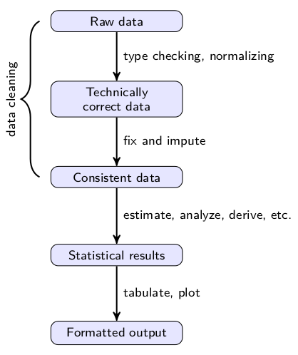

Libraries

-  `plyr`
-  `openintro`
-  `VIM`

Announcements
=============

-  OMET evaluation 
-  Presentations
  -  Bring two hard copies of your slides.
  -  Load slides onto computer right before class. (note: If your slides are in the cloud, download them onto the class computer)
-  Senior Design EXPO
  -  6PM - 8:30 PM Soldiers and Sailors Memorial Hall 

Next steps
============

- Programming in R
  -  Introduction to R - manual in the Help section of R Studio
  -  Microsoft EdX, Introduction to R Programming
- Using R in statistics
  -  Introduction to Probability and Statistics using R (IPSUR package)
  -  R Commander GUI (RCmdr, RCmdrPlugin.IPSUR) (creates a log of R commands that correspond to the menu items shown)
- Data manipulation
  - Grolemnd, Wickham, 2016, R for Data Science, http://r4ds.had.co.nz/
  
Final topics
=============

- 1 crib sheet (letter size, both sides)
- CoNVO statement
- Visualization: Interpretation and design
- Algorithm - Process
  -  Aggregation/summary
  -  Cleaning data
  -  Missing Values Imputation
  -  Linear Regression

Data manipulation
=================

1.  Filter (`subset`)
2.  Arrange (`sort`)
3.  Select columns (`merge` or conditional columns)
5.  Distinct rows (`unique`)
6.  Mutate (create a calculated value in a data frame)
7.  Summarize (`plyr`)
8.  Random sample (`sample`)

Aggregation using Plyr
=============
type:section

Aggregation
===============

- Aggregation or summarizing is a common data manipulation task.
  -  Mean, standard deviation, counts
- Many ways of doing this
  -  `aggegate`
  -  `table`
  -  `plyr`
  -  `apply`
- We will cover `plyr`
-  Readings
  -  *GGplot book* - Chapter 9.1
  -  *Split-apply-combine* article linked in Courseweb announcement posted March 18
    [The Split-Apply-Combine Strategy for Data Analysis](https://www.jstatsoft.org/article/view/v040i01)

Split-apply-combine
----------

-  A common data analysis pattern.
  -  `pattern` - A structure that is used to approach types of problems
  -  Originated in architecture, often used in fields that involved developing and implementing creative solutions.
-  Break up a problem into manageable pieces.
-  Operate on each piece independently.
-  Re-combine the pieces with the results.
-  e.g. calculating marginal statistics based on grouping the data based on a factor.


Naming of plyr functions
----------

- Functions in `plyr` are named based on
  -  The type of input it accepts
  -  The type of output it produces

- Types
  - `a` = array (includes matrices and vectors)
  - `d` = data frame
  - `l` = list
  - `_` = Output is discarded

Arguments
----------

-  Functions have two or three main arguments, depending on type of input.
  -  `a*ply(.data, .margins, .fun, ..., .progress="none")`
  -  `d*ply(.data, .variables, .fun, ..., .progress="none")`
  -  `l*ply(.data, .fun, ..., .progress="none")`
- Components
  - `.data` - dataset that will be broken up
  - `.margins` - What axis will be used to summarize over (1 = row, 2=column)
  - `.variables` - What variable will be used to groups (similar to GROUP BY in SQL)
  - `.fun` - What function will be used on each element of the list, row of data.frame, or across axis of an array.
  - `...` - any additional arguments that may be needed by the function specified in `.fun` 

- This will result in a much reduced, aggregated dataset.

Common `.fun`
----------

- Note: in all cases, the `...` is replaced by a statement, or it can be a function that returns the value needed.
-  `subset` Filter data based on a logical statement.
-  `summarize` Apply a summary function to the group identified by the `.variables`
-  `transform` Apply a function to each item

Some examples
============

```{r}
library(ggplot2)
library(plyr)
data(diamonds)
summary(diamonds)
```


Count observations
--------------------

- `ddply` takes a data.frame and returns a data.frame
- `.(color)`  identifies the variable to summarize over. Paranthesis here tells R that this is a variable from the data frame.
- `length` is the length of the data frame after choosing by `color`. Used to count observations.

```{r}
ddply(diamonds, .(color), summarize, count=length(carat))
```

Select smallest (min)
----------------
- `subset` is the function to apply (in this case as a filter)
- Everything else are argumenents to the function being applied
  - `carat==min(carat)`
```{r}
head(ddply(diamonds, .(color), subset, carat == min(carat)),10)
```

Select 2 smallest for each cut
-----------

-  Something more sophisticated
-  Use order function to sort (smallest to largest) then pick 2
```{r}
head(ddply(diamonds, .(color), subset, order(carat) <= 2), 10)
```

Calculate average size by cut and color
------

- `summarize` applies a summary function to each group

```{r}
head(ddply(diamonds, .(cut, color), summarize, mean =mean(carat, na.rm=TRUE)), 20)
```


Select largest 1% of each cut
-------------------

```{r}
head(ddply(diamonds, .(cut), subset, carat > quantile(carat, 0.99)), 10)
```


Cleaning data
============


Steps in the value chain
----------------------
  
-  Read in raw data
-  Transform it into technically correct data
-  Correct it into consistent data
-  Perform analysis
-  Present analysis in a usable form

***
  


The steps in the value chain
----------------------
  
  
-  Read in raw data
  - Take the source data and bring it in to the data analysis tool.
-  Technically correct
  - Put the data into a form that is usable by the data analysis tool.
-  Consistent data
  - Ensure correctness of the data prior to analysis.
-  Perform analysis
  - All of your other classes.
-  Present analysis in a usable form
  - Create summaries, plots, tables, figures and interpretation.

Components of ensuring correctness
----------------------
  
- Making data consistent
-  Handling special values
-  Identifying and handling errors
-  Identifying and handling outliers
-  Handling missing values.

Outliers
=========

-  An observation or set of observations which appear to be inconsistent with that set of data.
-  How do you know that they are inconsistent?
-  Subject expertise.
-  Clustering (machine learning)
-  Box and whiskers
-  `boxplot.stats()` function

Box and whiskers
------------

Example: On Base Percentage of hitters based on position.

1.  Load data and group positions into categories: infield, outfield, pitcher, catcher
```{r}
library(openintro)
data("mlbBat10")
mlbNames <- c("name", "team", "position", "G", "AB", "R", "H", "RBI", "BB", "SO", "SB", "CS", "OBP", "SLG", "AVG")
mlbBat10$posgroup <- as.factor(ifelse(mlbBat10$position %in% c("1B", "2B", "3B", "SS"), "IF",
                          ifelse(mlbBat10$position=="P", "P",
                             ifelse(mlbBat10$position=="C", "C", 
                                ifelse(mlbBat10$position=="OF", "OF", 
                                   ifelse(mlbBat10$position=="DH", "DH", NA))))))
                               
table(mlbBat10$posgroup)
obpbox <- boxplot(OBP ~ posgroup, data=mlbBat10, 
                  main="OBP by position", ylab="OBP")
```

1.  Determine the median
2.  Determine the 25 and 75 quartiles.
3.  Calculate the Inter Quartile Range (IQR) (this defines the box)
4.  Extend the box by 1.5 X IQR. Furthest points within this range are the whiskers.
5.  Anything beyond the whiskers are outliers.

Output of boxplot
-----------

- `obpbox$stats` Returns a array with a row for each group with five items each
  1. Lower whisker
  2. Lower hinge (25\% quantile)
  3. Median
  4. Upper hinge (75\% quantile)
  5. Upper whisker
- `obpbox$out` returns all outliers (beyond the lower or upper whisker)
- `df[df$x $in$ boxplot$out,]`  will list elements in the dataframe that are listed among the outliers.

```{r}
obpIF <- boxplot(mlbBat10[mlbBat10$posgroup=="IF","OBP"], 
                 main="OBP for infielders",ylab="OBP")
obpIF$stats
head(obpIF$out)
obpIFout <- mlbBat10[(mlbBat10$posgroup=="IF" & mlbBat10$OBP %in% obpIF$out),]
head(obpIFout)
```

Handling outliers
===================
  
- Determine what kind of outliers they are:
  -  Is something changing the process that does not occur regularly?
    - Then remove it
  -  It is because there is an occasional event that recurs?
    - Keep it in the data set

Obvious inconsistencies
------------
  
-  Variable values that cannot occur in a single observation.
-  Examples
  -  Age cannot be negative
  -  A male cannot be pregnant
  -  Create a function that checks for these
-  Check using a conditional and assigning a value


Missing value imputation
==========================
type:section

Imputation
------------

-  *Imputation* is the estimating or deriving values when data is missing.
-  Characteristics to consider
  1. Is it fair to replace a value by a summary value?
  2. Do you need to maintain variability in the final dataset?
  3. Are you going to make decisions on individuals or groups? 
    - If you make decisions on groups, it is acceptable to impute using methods that include randomness.
    - If you make decisions on individuals, you must make sure that the imputation does not harm the individual.
  

Method for imputation
------------
  
-  Which method to use for imputation depends on what information is available and what is the relationship between samples.
-  Summary functions (mean, median)
-  *k* Nearest Neighbors
-  Hot deck imputation
-  Minimal value adjustment
-  Linear regression


  
Using summary functions
------------

-  Assign to the missing value the value of the mean or another summary function.
-  mean, median
-  The mean could be conditional based on some other variable.

Imputing with the mean
------------

Some of our baseball players did not have positions assigned.


```{r}
mlbI <- mlbBat10$position=="-"
mlbBat10[mlbI,"position"]<-NA
mlbBat10[mlbI, mlbNames]
```

- Now, assign the mean to the missing values
- Identify which ones are missing values
- Calculate the mean of the rest (most common value)

```{r}
mlb1 <- mlbBat10
mlb1[which(is.na(mlb1$position)),"position"] <- names(which.max(table(mlb1$position)))
mlb1[mlbI,mlbNames]
```

Linear regression imputation
------------
  
-  Use a linear regression model to impute a missing value
$$y_i = \beta_0 + \beta_1 y_{1,i} + \beta_2 y_{2,i} + ...$$
  -  In **R**
  -  Develop the linear regression model using `lm`
-  Impute the missing value using `predict`

Ratio imputation
------------
  
- One variable is a multiple of another

Iris example
------------
  
- Three species of iris  
- Petal and Sepal length and width data of irises
- Often the Sepal.Length is missing

```{r}
data(iris)
iris$Sepal.Length[1:10] <- NA
I <- is.na(iris$Sepal.Length)
iris[I,]
```

Ratio imputation
------------
  
```{r}
R = sum(iris$Sepal.Length[!I])/sum(iris$Petal.Length[!I])
iris$Sepal.Length[I] <- R * iris$Petal.Length[I]
iris[I,]
```


Use linear regression
------------

```
model <- lm(Sepal.Length ~ Sepal.Width + Petal.Width, data = iris)
```
-  Use a linear regression model to relate Sepal Width to Petal Width
- Note the notation is like what we use in `ggplot`
- Left side is the dependent variable, right side are the predictors.
- Use `+` to separate predictors that are independent of each other.
-  Use that model with the observations with a missing value

Linear model implementation
------------

```{r}
iris$Sepal.Length[1:10] <- NA
I <- is.na(iris$Sepal.Length)
model <- lm(Sepal.Length ~ Sepal.Width + Petal.Width, data = iris)
iris$Sepal.Length[I] <- predict(model, newdata = iris[I, ])
iris[I,]
```

Hot deck imputation
------------
  
-  Assign to the missing value a random draw from the other samples.
-  Can be conditional on other variables.
-  Note that it maintains the distribution of values for the variable

Hot deck example
------------

Let's impute the position condition on players that are close in batting average (AVG)

```{r}
mlb2 <- mlbBat10
mlb2[mlbI,mlbNames]
hotdeckmlb = function(battingavg){
  fillin <- sample(mlb2[((mlb2$AVG< (mlb2$AVG+.1)) & (mlb2$AVG > (mlb2$AVG-.1)) &
                          !is.na(mlb2$position)), "position"],1)
}
for (i in which(mlbI)){
  mlb2$position[i] = hotdeckmlb(mlb2$AVG[i])
}
mlb2[mlbI,mlbNames]
```


K Nearest Neighbors
------------
  
-  Compute a degree of dissimilarity.
-  based on defining a *distance* function
-  Identify the nearest *k* samples to the one to be filled in.
-  Take the average value of the missing variable among the *k* nearest samples.

Gower's distance
------------

-  Difference between two variables as a fraction of the maximum such distance
$$d_g(i,j) = \frac{\sum_k w_{ijk}d_k(i,j)}{\sum_k w_{ijk}}$$
-  If $k$ is categorical, $d_g(i,j)=0$ if $k$ are the same, 1 otherwise.
-  If $k$ is numeric, $d_g(i,j) = \frac{1-(x_i-x_j)}{max(x) - min(x)}$

kNN implementation
------------

-  Take the Iris data, and randomly create some empty values
```{r}
library(VIM)
set.seed(1234)
mlbBat10[mlbI,mlbNames]
```


kNN results
------------
Use kNN to fill in the empty values
```{r}
mlb3 <- kNN(mlbBat10)
mlb3[mlbI, mlbNames]
```

Minimal value adjustment
------------

-  Missing value imputation methods may lead to inconsistent data.
-  Adjust the added values the minimal amount needed to be consistent.
- Remember, you have a function that checks for inconsistent data
-  Usually use a weighted Euclidean distance in the case where more than one missing value has been added.
$$\sum_i w_i (x_i-x_i^0)^2$$

Considerations
------------

-  What type of analysis will be done next?
-  Does the information that you do have tend to suggest a value to replace the missing value with?  Is there a mechanism that leads to a relationship?
-  Is there a conservative direction a value can take?
  - Conservative: Maintain the status quo. If you are going to err, err in the direction of not making changes.


