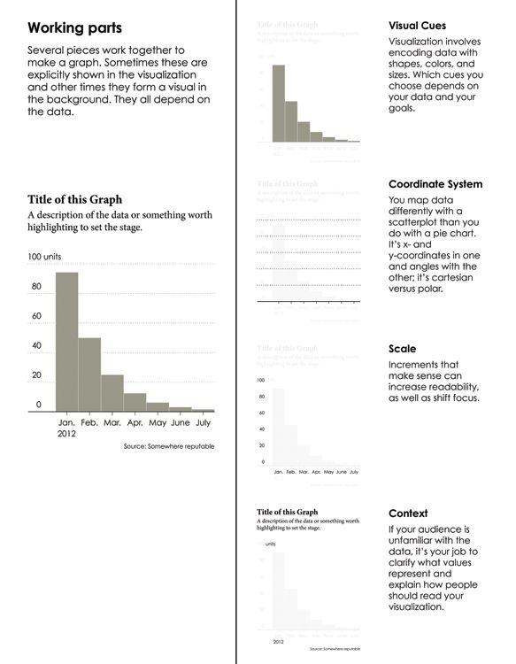
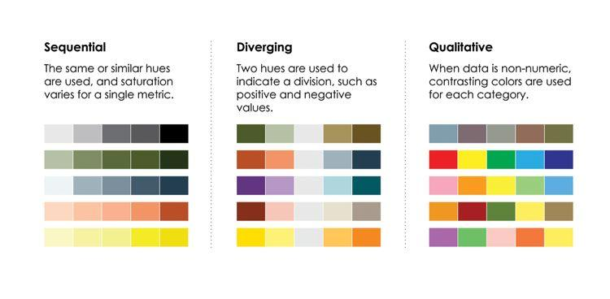

Midterm
=========

-  CoNVO
-  Data manipulation (verbs)
    -  Process maps
    -  SQL, R, plain english
    -  Tidy data
    -  Aggregation
    -  Character strings
    -  We will not be grading syntax
-  Data analysis
  -  Sketch a visualization
  -  Interpret a data summary or data visualization

Summarizing data
=================

What is visualization for?
==========================

-  Analysis and exploration
-  Communicate and present information
-  Entertainment
-  Art

How do we represent data?
=========================

-  Use visual cues to show values.
-  Shapes, colors, scales, position.
-  Visualization is how we summarize raw data to communicate meaning.
-  What makes for a good visualization?

Visualization components
========================

Visualization components
========================

Visual cues
===========

Ranking visual cues
===================

Some visual cues are more clear than others

Coordinate systems
==================

Coordinate systems dictate the dimensions of the visualization.

Scales
======

Scales dictate where in the dimensions the data maps to.

Using visualization
===================

Data exploration questions to ask?
==================================

-  What data do you have?
-  What do you want to know about your data?
-  Which visualization methods should you use?
-  What do you see and does it make sense?

Choosing a visualization
=========================

-  What is the main point of the chart?
    - Comparison, relationship, distribution, composition
-  How many dimensions are we trying to communicate?
    - One, two, many
-  How do values change?
    - Over time, among items, static?
-  How much data is there?
    - Few data points, many data points?
    - Continuous, discrete?

Thinking about types of visualizations
====================================

Visualizing categorical data
============================

Time
====

Time is continuous, but you can also divide it into categories.

Time series
===========

How does your data change over time?

Visualizing spatial data
========================

Combining components
====================

By combining components, graphs are richer and can display many relationships at once.

Multiple variables
==================

There is no hard limit to how many variables can be in one visualization

Data distribution
=================

- Visualization can show how data is distributed in a population
- Box plots
- Histograms
- Density plots

Visualizing distributions
=========================

Comparisons
===========

One thing that visualizations should do is show how things change.

Color scales
============

-  Sequential
-  Diverging
-  Qualitative

Highlighting
============

Emphasize a particular data point or series to place focus

Annotation
==========

Give context to data or explain boundary cases.

Making things pretty
====================

- Thinking about aesthetics helps tell the story.

Summary
=======

-  Think in terms of telling a story.
-  What is the message?
-  What is the main point?
-  How to tell it?

