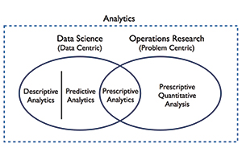
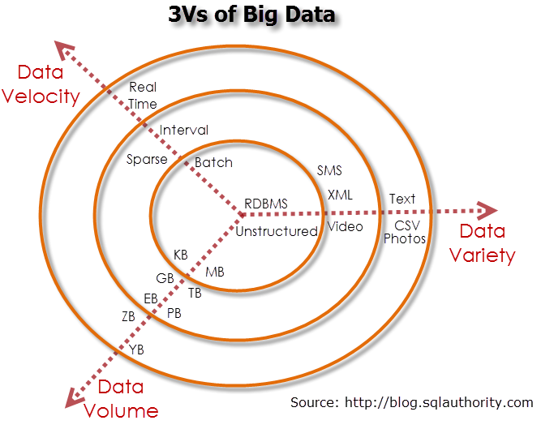
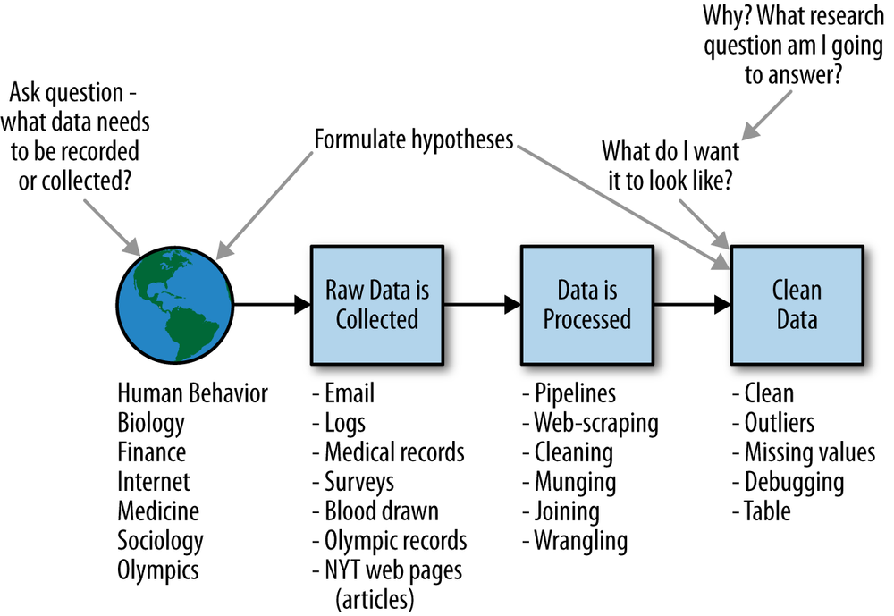
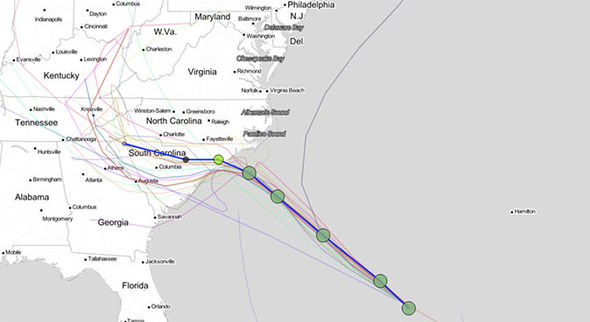
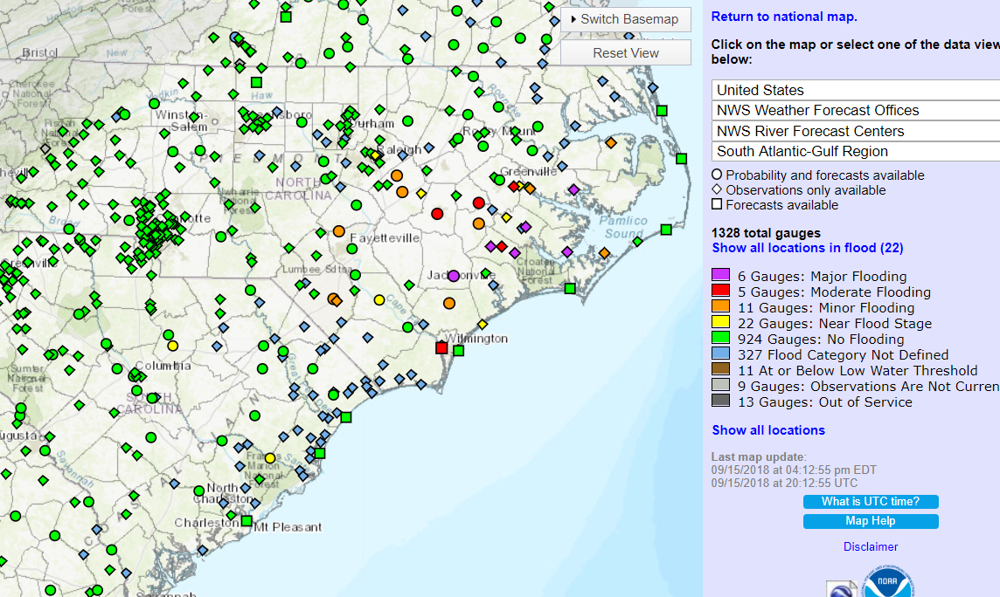
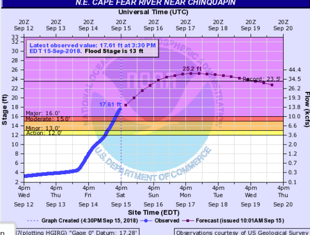
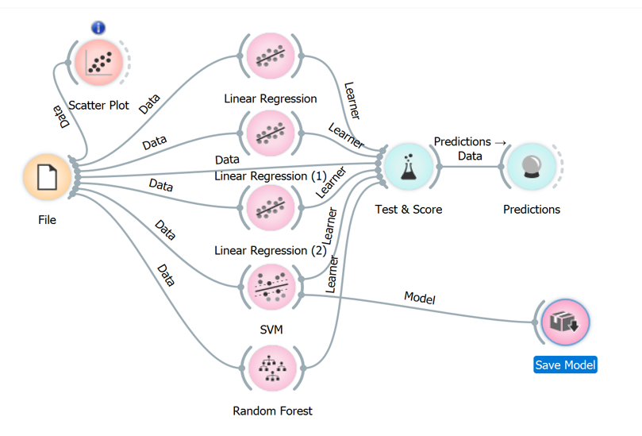

```{r setup, include=FALSE}
knitr::opts_chunk$set(echo = FALSE)
library(nycflights13)
library(ggplot2)
library(dplyr)
```


#  Introduction

## Who am I

-  Louis Luangkesorn
-  Assistant Professor of Industrial Engineering
-  Former Associate Operations Researcher RAND Corporation
-  Current research:
    -  Health care operations
    -  Disaster response
    -  Data science
    -  Simulation methods
    
## What we will cover

-  What is analytics?
-  What questions can we answer using quantitative methods?
-  How do I ask good questions as a consumer of quantitative analysis?
-  How can I work with quantitative analysts?

#  What is analytics?

## Definition of analytics

- *The Analytics Section of INFORMS is focused on promoting the use of data-driven analytics and fact-based decision making in practice. The Section recognizes that analytics is seen as both (i) a complete business problem solving and decision making process, and (ii) a broad set of analytical methodologies that enable the creation of business value.*  
    -  INFORMS Section on Analytics


## Three categories of Analytics

- Descriptive analytics
- Predictive analytics
- Prescriptive analytics

```{r, out.width = "150px", echo=FALSE}

```

##  Descriptive analytics

- Identifies patterns from samples for reporting of trends
-  How does $A$ compare with $B$?
-  How does $A$ change over time?
-  How much does $A$ vary?

## Predictive analytics

- Predicts future probabilities and trends
- Finds relationships in data that may not be readily apparent with descriptive analysis
-  What is the current trend of A?
-  There is a new observation $a$ which is a type of A, what are its characteristics?
-  How does my system perform?
-  Event $C$ just occurred, what will A be in the future?

## Prescriptive analytics
- Evaluates and determines new ways to operate
- Targets business objectives
- Balances all constraints
-  What is the best way of designing my system?
-  What is the best way to allocating figures for a goal?
-  I am trying to stop someone from accomplishing their goals? What is the best way for them to accomplish their goals, and what is the best way for me to stop them?


## Some methods used analytics (i.e. buzzwards)

-  Business Intelligence - Focus on displaying data summaries from data found in databases. Often refers to visualizations.
-  Statistics - Methods of testing hypothesis using observed data.
    -  Data science - Predictive models -  Predict an outcome
-  Operations Research - Mathematical models of operations

   
```{r, out.width = "150px", echo=FALSE}

```
    
#  What questions can we answer using quantitative methods?


## What is the use of analytics?

-  The results of data analysis should be a decision.
-  What is the driver/key variable that will drive the decision to be made?
    -  What information will drive the decision?
    -  What are the possible alternative data outcomes and how will they change your decision?
-  What is the alternative to analysis?

##  All models are wrong

* *Remember that all models are wrong; the practical question is how wrong do they have to be to not be useful.*
    - George Box
* *Everything should be a simple as possible, but no simpler.*
    - Einstein (attributed)


#  How do I ask good questions as a consumer of quantitative analysis?

## Why are you talking to an analyst?

-  What are potential results of the data analysis?
-  What kind of argument will you make with the data?
-  What kind of decisions will result from seeing outcomes?

## Goals of a data analysis

-  The results of data analysis should be a decision.
-  The results need to advocate one choice over another.
-  Question:  What makes a convincing case of one choice over another?  Will the data analysis provide that case?
    -  What information will drive the decision?
    -  What are the possible alternative data outcomes and how will they change your decision?

## Aspects of an argument

-  Who needs to be convinced? What is their background, their priorities?
-  Are they interested in subjective or objective measurements?
-  Do they need an experiment?

This defines how simple or complex the data analysis needs to be.

## Talking about results

-  How will the data be used to support the decisions?
-  How should the data be presented to best support the use of the data?
-  Mockups of the output
    -  Example reports of outcomes
    -  Simplified graphs
    -  Sketches of displays or user interfaces to spark discussion of on what information is required
-  Build intuition
    
## Outcome

-  How will the data analysis be used?
-  How will it be integrated into the organization?
-  Who will own the integration?
-  Who will use it?
-  How will success be measured?

## Four Aspects of data you need to know

- Volume
- Velocity
- Variety
- Veracity

```{r, out.width = "200px", echo=FALSE}

```

## Veracity


-  Is the data we are looking at relevant to the question being asked?
-  Is the data is of uncertain origin, of uncertain quality, and of uncertain relevance.
-  Contrast with the case where the data collection is designed for the purpose of doing the analysis.
-  e.g.  data collection errors, typos, incorrectly defined.

```{r, out.width = "200px", echo=FALSE}

```

## Volume

-  How much are you working with?
-  How was it collected?
-  How complete is it?

```{r, out.width = "200px", echo=FALSE}

```

## Variety

-  How many different examples are in the data set?
-  Does diversity in the dataset match the population of interest?
-  How to ensure that you are not missing minority members of the population?

```{r, out.width = "200px", echo=FALSE}

```

## Velocity

-  Data can be time sensitive.
-  Static data (census)
-  Does data change in character over time (changing setting or procedures)
-  Does a decision need to be made with only current information

```{r, out.width = "200px", echo=FALSE}

```


## Measures of centrality and variance

-  For every number, there should be a measure of centrality, and a measure of the variation or error.
-  e.g. mean and standard deviation
-  All values should have an estimate of variance and error.

#  How can I work with quantitative analysts?

##  What is the role of the analysts?
```{r, out.width = "200px", echo=FALSE}
knitr::include_graphics("figures/Data_Science_VD.png")
```

##  How do quantitative analysts work?

```{r, out.width = "300px", echo=FALSE}
knitr::include_graphics("figures/tidy1.png")
```

##  Analysts workflow

-  Read in the data
-  Convert data into usable form
-  Exploratory data analysis
-  Develop hypothesis
-  Data manipulation
-  Modeling
-  Communicate result

##  Working with data

```{r, out.width = "300px", echo=FALSE}

```

## Exploratory Data Analysis

-  Visualizations
-  Tell potential stories through the visualization
-  Raise questions, develop alternative hypothesis

## Five basic visualizations

- Scatterplots
- Linegraphs
- Boxplots
- Histograms
- Barplots

## Scatterplots - Display the data points and patterns

```{r, echo=FALSE, fig.width=8, fig.height=4, warning=FALSE, message=FALSE}
all_alaska_flights <- flights %>% 
  filter(carrier == "AS")
ggplot(data = all_alaska_flights, mapping = aes(x = dep_delay, y = arr_delay)) + 
  geom_point() + ggtitle("Flights arrival delay vs departure delay") + theme_bw() +
  xlab("Arrival delay") + ylab("Departure delay")
```

## Line plots - show trends

```{r, echo=FALSE, fig.width=8, fig.height=4, warning=FALSE, message=FALSE}
early_january_weather <- weather %>% 
  filter(origin == "EWR" & month == 1 & day <= 15)
ggplot(data = early_january_weather, mapping = aes(x = time_hour, y = temp)) +
  geom_line() +ggtitle("Weather in January") + theme_bw() +ylab("Hourly temperature")
```

## Histograms - Show distribution
```{r, echo=FALSE, fig.width=8, fig.height=4, warning=FALSE, message=FALSE}
ggplot(data = weather, mapping = aes(x = temp)) +
  geom_histogram() + theme_bw()+ xlab("Days") +ylab("Daily temperature")
```

## Boxplots - Variation and outliers
```{r, echo=FALSE, fig.width=8, fig.height=4, warning=FALSE, message=FALSE}
ggplot(data = weather, mapping = aes(x = factor(month), y = temp)) +
  geom_boxplot() +ggtitle("Temperature by month") + theme_bw() + xlab("Month") +ylab("Daily temperature")
```

##  Bar plots - Comparing values and percentages
```{r, echo=FALSE, fig.width=8, fig.height=4, warning=FALSE}
ggplot(data = flights, mapping = aes(x = carrier)) + ylab("Number of flights") +
  geom_bar() + theme_bw()
```

## Transform and model

-  Create falsifiable hypothesis
-  Create experiment/approach to test hypothesis
-  Develop statistical/mathematical model
-  Communicate results with subject matter expert
-  Develop new thesis and repeat

##  Communicate results

-  How to report results
-  How to communicate with stakeholders
-  How to let stakeholders explore scenarios


##  How to ask good questions?

-  Define the problem
    -  Usually a potential decision that needs to be made.
    -  What are the alternative decisions?
-  Think about how the results will be used?
    -  What choices correspond to the possible outcomes of the analysis?
-  What is the role of uncertainty?
    -  How sensitive is the decision making to the possible outcomes of the analysis?
    -  What is the cost of the sensitivity?

## Preparing data

- You are preparing data for use in computation and analysis, not to make a table for presentation
- Data analysts prefer data that is dis-aggregated, they should be able to aggregate and summarize easily as needed
- Data table
    -  Rows represent observations
    -  Columns represent variables describing observations
    -  Some columns uniquely define the row (e.g. keys)
    -  Some columns are informative
- Each cell should have one piece of information
    - Numbers should be separated to enable computation
-  Database professionals know how to organize data so that this can work if you are unable.

## Basic data operations

Some data operations that are easy so data analysts do not want you to aggregate data

*  Filter (select rows)
*  Arrange (sort)
*  Select columns
*  Distinct rows (UNIQUE)
*  Mutate (calculations)
*  Summarize (sum, average, etc.)
*  Random sample (for simulation)

#  Example - Hurricane Florence Mass Care resources

##  Hurricane Florence path




##  Decision to be made

-  How much sheltering and feeding resources should be mobilized to be sent into North and South Carolina (and GA and VA) for Hurricane Florence?
    -  Shelter supplies (cots, blankets, showers)
    -  Feeding (kitchens, meals, water, fuel)
    -  People (sheltering, feeding, and kitchen staff)
-  How sensitive is this to errors?
    -  Location?
    -  Quantity?

## What information do we need to decide how much and where?

-  If we cannot get that information, is there a useful proxy?
-  If the information is not directly available, can we build a model?
    - Statistical
    - Operations research


##  What data is available?

-  Hurricane track and estimated wind.
-  Hydrology (river forecasts)
-  Demographics

##  Hydrology



##  Specific hydrology



## Sources of uncertainty

-  Path it will take
-  Wind
-  Level of flooding on rivers
-  What is the impact on uncertainty?

##  Impact of uncertainty

-  How uncertain is the hurricane location?
-  What is the impact of being off by 10% on sheltering needs? Feeding needs?
    - 20%
    - what if you would have a better answer the next day?
    
## Modeling

- Gather data from historical damage assessment, historical floods, demographics, and current flood gages
- Create a predictive model

```{r, out.width = "250px", echo=FALSE}

```


##  Output

- Predict damage by county
- Show forecasted flood stage and duration
- Used in other models to estimate other resource requirements.

# Conclusion

## Key questions

-  The results of data analysis should be a decision.
-  What is the driver/key variable that will drive the decision to be made?
    -  What information will drive the decision?
    -  What are the possible alternative data outcomes and how will they change your decision?
    
# Questions?
